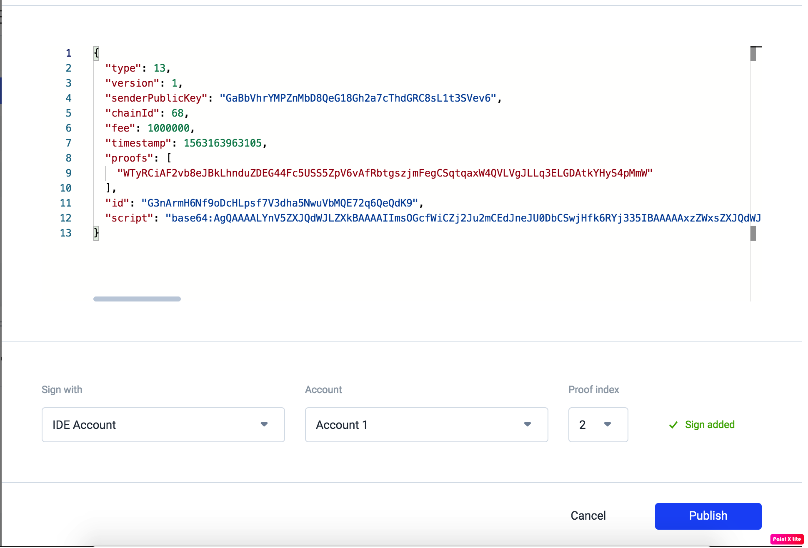

# Waves Escrow dApp sample with waveJ API

## Overview

This sample dApp is for buying physical goods with cryptocurrencies. 

Should the buyer trust the seller and pay before receiving the goods? Should the seller trust the buyer and ship the goods before receiving payment? This problem can be solved by using a third party escrow service. The problem can be resolved using Waves multisignature feature. 

In the solution, the money is not sent directly to the escrow service’s address, but instead, it is sent to a 2-of-3 multisig address with one key controlled by each of the transacting parties and one controlled by the mediator. When there is no dispute, the two transacting parties can create together the transfer transaction. Only if there is a dispute the mediator will get involved, collaborating with either the buyer or seller (as appropriate) to redeem the funds.

## Step 1. Clone the project
`git clone https://github.com/Morpheuslabs-io/waves-dapp-sample-01`

## Step 2. Configure Ride IDE

### Open Ride IDE

Open a server tab in the terminal, and then click on waves-ide link to open Ride IDE


### 
Lets generate a new account in order to attach dapp scripts later, by clicking generate new account.


After creating the account, there is no any waves token yet in the account. We will send some waves tokens to the account from the genesis account later.


Then, Open Wave BlockChain Ops and click on retrieve button to get genesis account info, copy seed for later usage.


Next, let configure Ride IDE to connect to our blockchain ops. Click on setting icon and click add node with 
External RPC URL from blockchain ops.


## Step 3. Send Waves and deploy contract script

After finish configuration, it's time to make some transactions.
Ok, now we send some waves to new account we just created, unfortunately, waves does not provide wallet for development network yes, so we need to use some Ride Console and javascript to do it.

```javascript
// the seed you just copy above
const seed = "FwGv7haZrYD5vNSmhYbmBg76fhyGCTatObCKiR3lxnHQVbA9EouYA0Hq4pLNmw7heFbwSJqe9H24uv3XFoID19JWsn8A6Wc2daMo"

// let define transaction object with 10 waves, we send from genesis account 
// recipient is your account address you just create
// amount is total waves need to send = waves*10^8
const txo = {
"type"4,
"senderPublicKey":"AGRAhCD5rJUQDG6mE54voaE4et8bdRu6kAenyfPyM6SB",
"recipient":'3FQ5tmDWAnQkkMNeWy8gYPBBqGy3XUSM7aE', 
"amount": 1000000000 
};

// sign transaction with seed
const signedTx = transfer(txo, seed);

// broadcast transaction to network
const result = await broadcast(signedTx)
"transactionId: "+result.id

```

Copy and paste these codes to Ride console, after run code, we get transaction Id, wait little bit to see waves available on your account.


Now we will deploy escrow dapp script to this account.
- Create dapp script by clicking on (+) icon and select dapp script
- Open file `src/main/resources/script.ride` and past it to Ride IDE
- Click on Deploy Account Script button
- Click Add sign button to sign for transaction
- And then final click on publish to deploy contract.


After finish deploy you can check on explorer script is attached to account, script tab.


## Step 4. Integrate with smart account with WaveJ API
 

### Update configuration
Open file `src\main\resources\application.properties`
- Update NODE_URL field to your node url
- Update BUYER_PK with correct private key of address with some waves in it
- Update BUYER_PK with correct private key of address with some waves in it

## Run app

```
cd waves-dapp-sample-01
mvn clean spring-boot:run` to run application
```

If you view java code you can see, withdraw transaction is sign by both buyer and seller, if there is only one signature, transaction could not make.

```java

    LOG.info("Seller request withraw money");
    Transaction tx1 = Transaction.makeTransferTx(smartAccount, sellerAddress, 1000000000,"WAVES", fee * 4 ,"WAVES", "Sending Money");

    //Buyer and Seller sign the deal with proofs
    String buyerSig =  buyer.sign(tx1);
    LOG.info("Buyer accept transaction by signning it: {}", buyerSig);
    
    String sellerSig =  seller.sign(tx1);
    LOG.info("Seller sign with transaction: {}", sellerSig);
    tx1 = tx1.withProof(0, buyerSig);
    tx1 = tx1.withProof(1, sellerSig);
```
