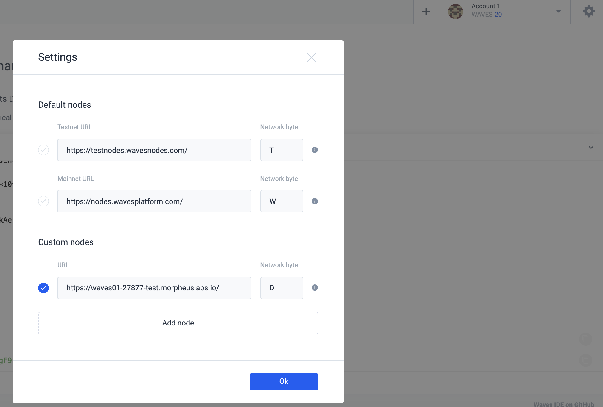

# Waves Escrow dApp sample with waveJ API

## Overview

This sample dApp is for buying physical goods with cryptocurrencies. 

Should the buyer trust the seller and pay before receiving the goods? Should the seller trust the buyer and ship the goods before receiving payment? This problem can be solved by using a third party escrow service. The problem can be resolved using Waves multisignature feature. 

In the solution, the money is not sent directly to the escrow service’s address, but instead, it is sent to a 2-of-3 multisig address with one key controlled by each of the transacting parties and one controlled by the mediator. When there is no dispute, the two transacting parties can create together the transfer transaction. Only if there is a dispute the mediator will get involved, collaborating with either the buyer or seller (as appropriate) to redeem the funds.

The steps below will show how to expore and run the Waves Escrow dApp on Morpheus Labs BPaaS platform (ML BPaaS).

Refer to https://docs.morpheuslabs.io/docs for more detailed information about ML BPaaS.

## Step 1. Clone the project
`git clone https://github.com/Morpheuslabs-io/waves-dapp-sample-01`

## Step 2. Configure Ride IDE

### Open Ride IDE

Open a server tab in the terminal, and then click on waves-ide link to open Ride IDE


### Generate New Account
Lets generate a new account in order to attach dapp scripts later, by clicking "Add Account", then "Generate new account" in the Ride IDE.


After creating the account, there is no any waves token yet in the account. We will send some waves tokens to the account from the genesis account later.


### Retrieve Info of Genesis Account

Then, Open Waves private network from BlockChain Ops on ML BPaaS and click on retrieve button to get genesis account info, copy "seed" info for later usage.


### Connect Ride IDE to Private Waves Node on ML BPaaS

Next, let configure Ride IDE to connect to our blockchain ops. Click on setting icon and click add node with 
External RPC URL from blockchain ops.



## Step 3. Send Waves token

Now we send some waves token to the new account that we just created. Unfortunately, Waves does not provide wallet for development network yet, so we need to use Ride Console with javascript to do it.

```javascript
// the seed you just copy above
const seed = "FwGv7haZrYD5vNSmhYbmBg76fhyGCTatObCKiR3lxnHQVbA9EouYA0Hq4pLNmw7heFbwSJqe9H24uv3XFoID19JWsn8A6Wc2daMo"

// let define transaction object with 10 waves, we send from genesis account 
// recipient is your account address
// amount is total waves toekn that to send = waves*10^8
const txo = {
"type":4,
"senderPublicKey":"AGRAhCD5rJUQDG6mE54voaE4et8bdRu6kAenyfPyM6SB",
"recipient":'3FQ5tmDWAnQkkMNeWy8gYPBBqGy3XUSM7aE', 
"amount": 1000000000 
};

// sign transaction with seed
const signedTx = transfer(txo, seed);

// broadcast transaction to network
const result = await broadcast(signedTx)
"transactionId: "+result.id

```

Replace the value of "recipient" with your newly created account address, then copy and paste the codes to Ride console, and then Enter to run the script. After running the codes, you will get a transaction Id as shown in the screenshot below. Wait for a while to see the waves token available in your account.


## Step 4. Deploy dAppp Script (smart contract)

Now we will deploy escrow dapp script to this account.
- Create dapp script by clicking on (+) icon and select dapp script
- Open file `src/main/resources/script.ride` and copy / paste it to Ride IDE
- Click on Deploy Account Script button
- Click Add sign button to sign for transaction
- And then final click on publish to deploy contract.


After the deployment, you can open the explorer to check the script is attached to the account.


## Step 5. Integrate with smart contract with WaveJ API

See how to have a Springboot based Java applicaiton to interact with Waves smart contracts.

### Exploer the Java application

Open the workspace that contrains the Escrow dApp and use the CDE to exploer the Java application.

### Update configuration

From the CDE, open the Springboot configuration file `src\main\resources\application.properties`
- Update NODE_URL field to your node url
- Update BUYER_PK with correct private key of address with some waves in it
- Update BUYER_PK with correct private key of address with some waves in it

## Step 6. Run Escrow dApp

Open a terminal in the CDE to run the application.

```
cd waves-dapp-sample-01
mvn clean spring-boot:run` to run application
```

From the java code, you can see that withdraw transaction needs to be signed by both buyer and seller, if there is only one signature, the transaction would not be done.

```java

    LOG.info("Seller request withraw money");
    Transaction tx1 = Transaction.makeTransferTx(smartAccount, sellerAddress, 1000000000,"WAVES", fee * 4 ,"WAVES", "Sending Money");

    //Buyer and Seller sign the deal with proofs
    String buyerSig =  buyer.sign(tx1);
    LOG.info("Buyer accept transaction by signning it: {}", buyerSig);
    
    String sellerSig =  seller.sign(tx1);
    LOG.info("Seller sign with transaction: {}", sellerSig);
    tx1 = tx1.withProof(0, buyerSig);
    tx1 = tx1.withProof(1, sellerSig);
```
